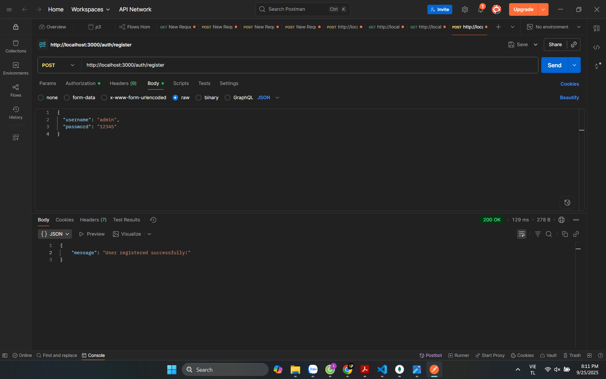
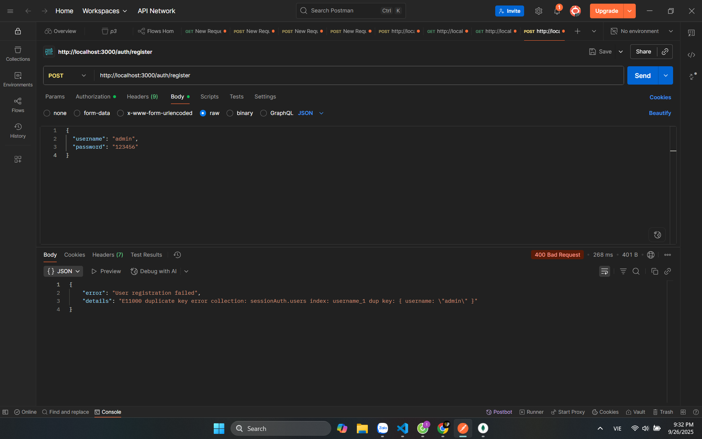
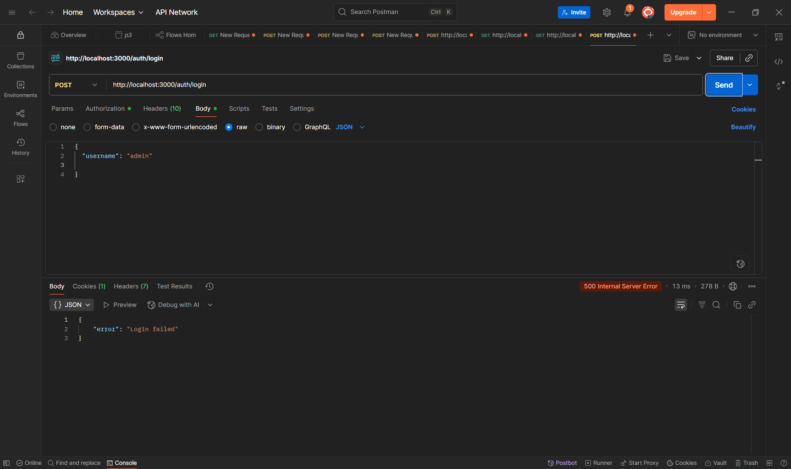

Yêu cầu hệ thống
Node.js (phiên bản 18 trở lên)

MongoDB (chạy cục bộ trên cổng 27017)

Postman (để kiểm thử API)
Cài đặt
Clone repository

Cài đặt các dependencies: npm install
Đảm bảo MongoDB đang chạy trên mongodb://127.0.0.1:27017

Khởi động server: node app.js
Server sẽ chạy trên http://localhost:3000
1. Đăng ký tài khoản
POST http://localhost:3000/auth/register

Body (JSON):
{
  "username": "admin",
  "password": "12345"
}

2. Đăng nhập
POST http://localhost:3000/auth/login

3. Trang hồ sơ (bảo mật)
GET http://localhost:3000/auth/profile

4. Đăng xuất
GET http://localhost:3000/auth/logout

5. Đăng ký lại với cùng username (lỗi)

6. Đăng ký lỗi username trống

7. Đăng ký lỗi password trống

Các trường hợp lỗi của ĐĂNG NHẬP (LOGIN)
8. Sai username hoặc password

9. Thiếu trường bắt buộc

